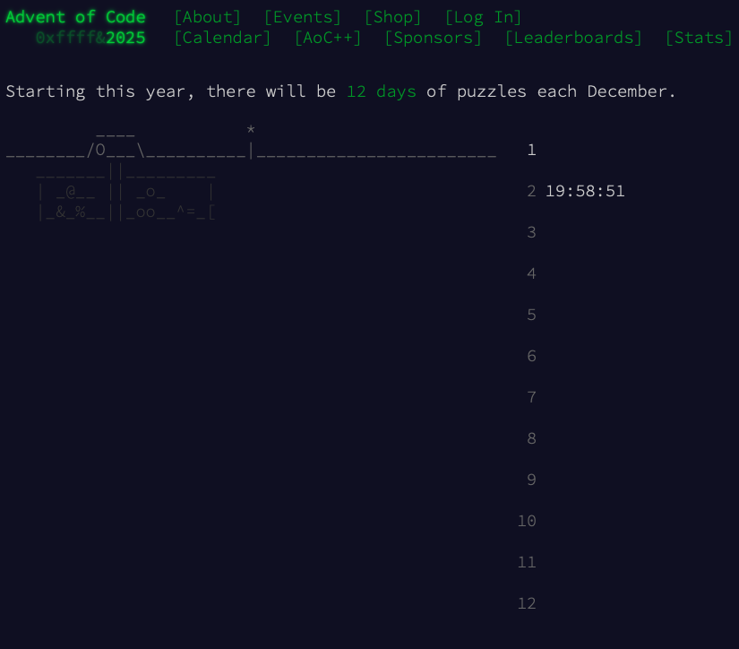

# Docs

```bash
          ____           *                <o
 ________/O___\__________|_________________0______ 
    _______||_________
    | _@__ || _o_  '.|_ _________________________    
    |_&_%__||_oo__^=_[ 
```

```bash
          ____           * 
 ________/O___\__________|________________________ 
    _______||_________
    | _@__ || _o_  '.| _ _________________________   
    |_&_%__||_oo__^=_[ \|     _    .. .. ..     |        
                     \_]__--|_|___[]_[]_[]__//_|   
```

- [Stats](STATS.md)

<!--  -->
